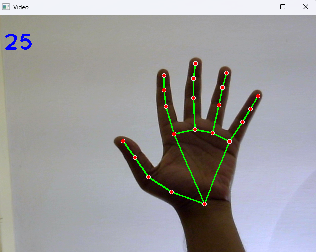
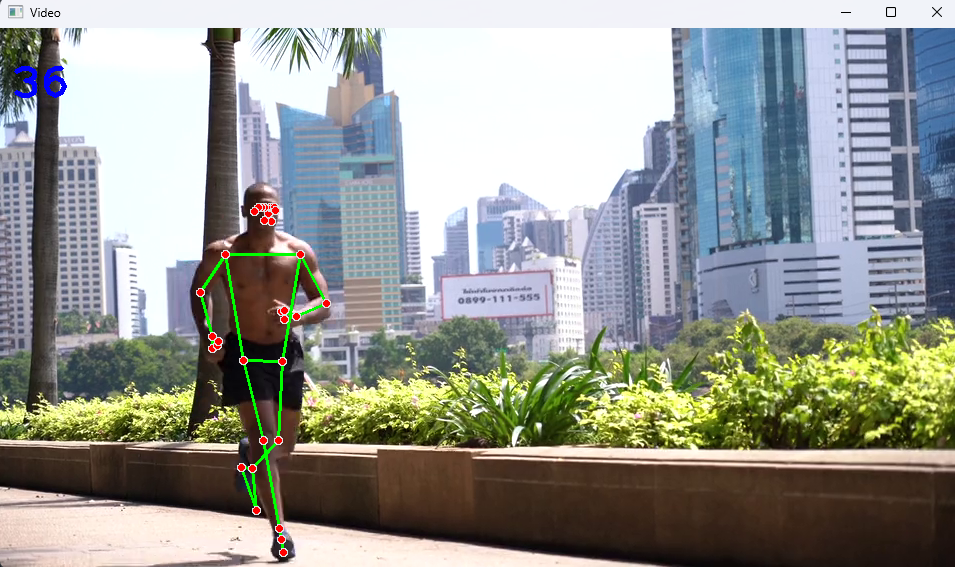

# OpenCV modules
List of modules made using OpenCV

## HandTracking-Module
A Module using OpenCV to track the 21 significant points of one or more hands.

- HandTracking-Module.py

## PoseTracking-Module

A Module using OpenCV to track upto 33 significant points of whole body.

- PoseTracking-Module.py

